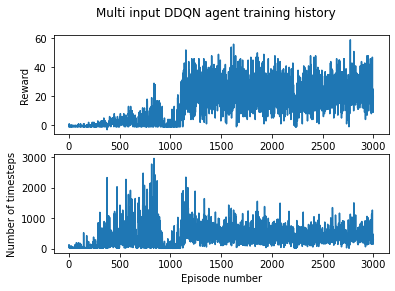

# RL-Snake
Deep reinforcement learning applied to the classic snake game, with the game implemented using the Python Arcade library and RL agents implemented using the 
Tensorforce library.   

A fully trained agent playing the Arcade implementation is shown below.

## Training an agent using the Double Deep-Q Network (DDQN) algorithm
After some experimentation, I found the DDQN model to work the best. The Q network takes in two inputs. The game grids of the current timestep and previous three are 
stacked together and passed through four convolutional layers followed by a fully connected layer. In addition, a size 11 binary input vector containing information about
the direction of motion, position of food and immediate collision dangers is passed through two fully connected layers with the output being concatenated with the output
of the convolutional network. This is followed by two dense layers before the final output four-unit action selecting layer (up, left, down or right). The agent is trained
with a 2nd order polynomially decaying epsilon-greedy parameter. 

###### Reward function
The reward function is always clipped to the range [-1, 1]. A reward of +1 is given when the agent eats an apple, increasing the length of the snake, and -1 when the agent
loses by crashing into itself or the boundary (the play area is a 20x20 grid). In other cases, a small positive reward is given which is inversely proportional to the
distance of the snake head from the apple, to encourage it to move towards the apple. If the food has not been eaten after a set number of timesteps, a small punishment is
applied, proportional to the timesteps without eating. 

###### Results
Plots of the reward and number of timesteps per episode are for 3000 training episodes are shown below.

There is an interesting dip in both graphs around 1000 episodes, potentially due to a change in the agent's strategy. 

When evaluating the final trained agent over 1000 episodes, it achieved a mean reward per episode of 29.9, with mean game score of 30.9, and mean timesteps per episode of 552.
